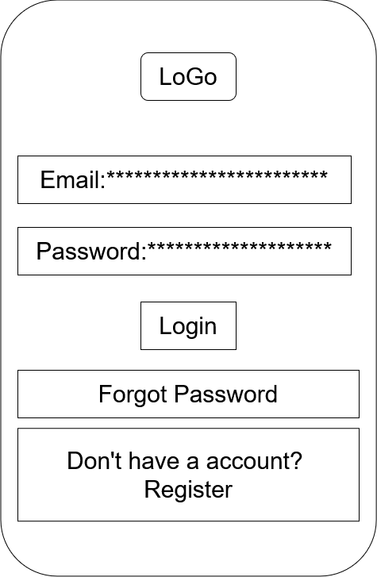
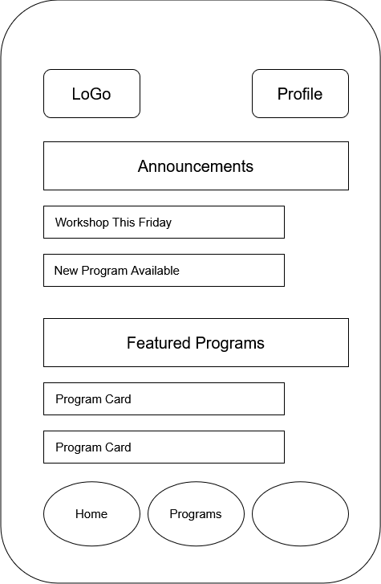
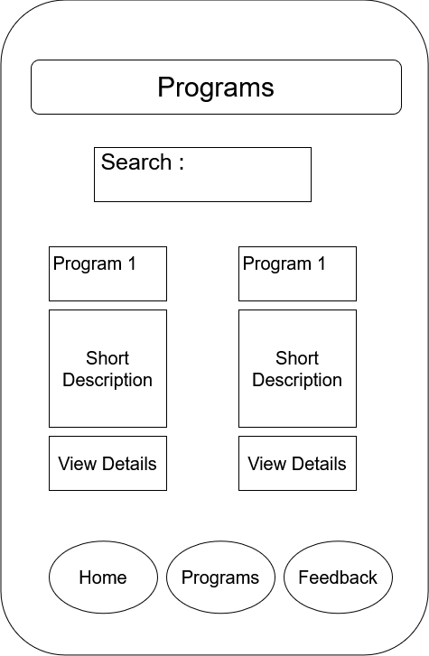
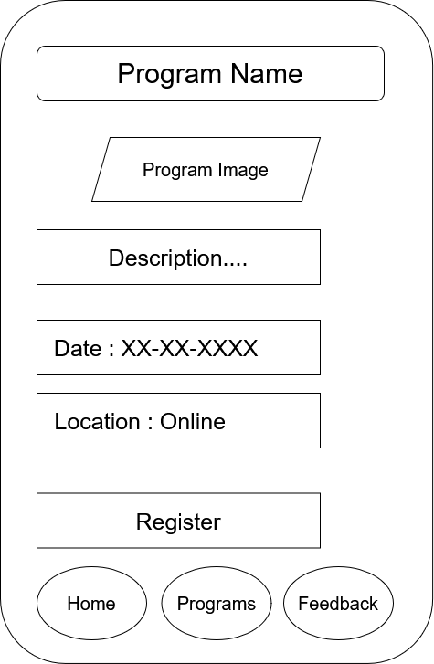
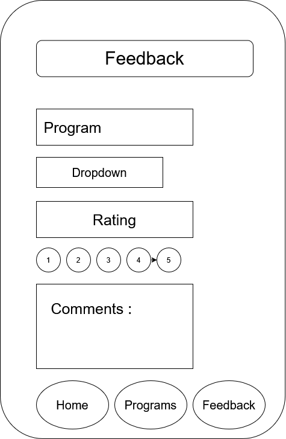
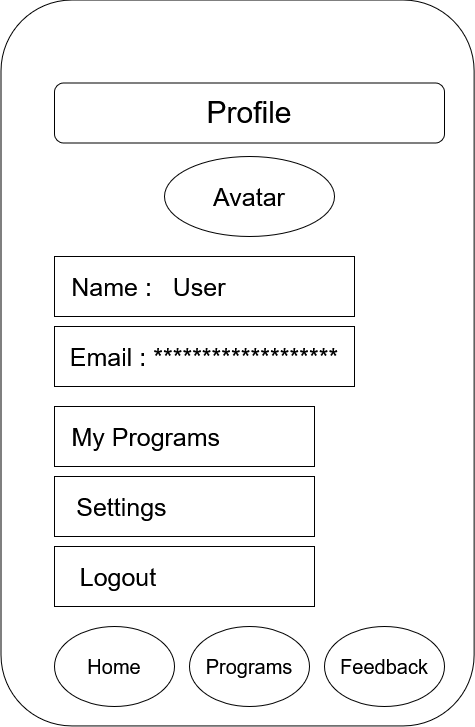

# Excelerate Mobile App – Week 1 Submission

## Student Information

**Name:** Zolani Mjikeliso

**GitHub Repository:**
https://github.com/4THComing/excelerate-mobile-app

---

# 1. App Proposal

## Purpose

The purpose of this application is to provide learners and administrators within the Excelerate ecosystem with a centralized mobile platform for program discovery, learning content access, event engagement, announcements, and feedback collection.

The application aims to improve communication, accessibility, and engagement between learners and administrators through a modern cross-platform mobile experience built using Flutter.

## Target Users

### Learners

* Browse available programs
* View program details
* Register for events
* Access learning content
* Submit feedback
* Receive announcements

### Administrators

* Publish announcements
* Manage programs
* Review user feedback
* Monitor participation and engagement

## Key Features

* User Authentication (Login)
* Home Dashboard
* Program Listing
* Program Details
* User Profile
* Feedback Submission
* Announcements & Notifications

## User Journey Example

A learner opens the application and logs into their account. From the Home Dashboard they see a new workshop announcement. They navigate to the Program Listing screen, select the workshop, view details, and register. After attending the event, they submit feedback using the Feedback Form. Administrators can review this feedback and use it to improve future events.

---

# 2. Wireframes

## Login Screen

## Home Dashboard

## Program Listing Screen

## Program Details Screen

## Feedback Screen

## Profile Screen

---

# 3. GitHub Repository Setup

Repository Link:

https://github.com/4THComing/excelerate-mobile-app

### Evidence of Version Control

.png)

### Repository Structure

.png)
.png)

---

# 4. Flutter Installation Evidence

### Flutter Doctor

---

# Conclusion

Week 1 objectives were successfully completed. Flutter was installed and configured, wireframes were created, the application proposal was documented, and the GitHub repository was initialized with version control enabled.
